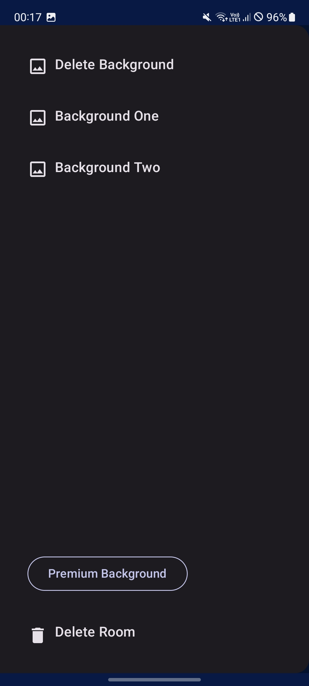

# ChatteR
Simple kotlin android app for making rooms and chatting   
Created to showcase my skills in android development

## Main Features
- User authentication with stored token
- Chat rooms (create and switch between rooms)
- Changing backgrounds for rooms
- Real-time synchronization
- Send & receive messages
- User management
- Simple navigation with Jetpack Compose
- Advertisement manager
- Dark theme support

## Built with
- Kotlin
- Jetpack Compose
- Jetpack Navigation
- MVVM + Repository
- Manual dependency injection
- Coroutines & Flow
- Data Store (Session Manager)
- AdMob
- Firebase Firestore
- Firebase Authentication

## Download

[Download ChatteR APK](https://github.com/komodobear/ChatteR-AndroidApp/releases/latest)

## Screenshots

  
  
  

  
  
  

